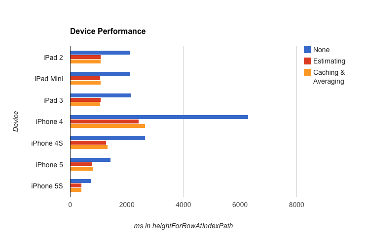

This repo is a fork of iOS7-day-by-day and is distributed under the same licence. It is not for the same purpose - here lesson 19 was used as a base to investigate how performance is affected by iOS7's `[-<UITableViewDelegate> tableView:estimatedHeightForRowAtIndexPath:]` and other speed optimisations around table views. 

###Key differences
* A new table delegate type that calculates the average calculated height so far to return in estimation. Good for `[-UITableView reloadData]`.
* Refactor height calculation into table delegate objects
* Make sure that the compiler doesn't optimise out the unnecessary wasteful tasks

###Results

iOS7-day-by-day
===============

This repo contains the sample projects which accompany a blog series which
takes a look at some of the new features available to developers in iOS7.
The blog series is available here:

http://www.shinobicontrols.com/blog/posts/2013/09/19/introducing-ios7-day-by-day/

If you have any suggestions / ideas / comments please feel free to catch me on
twitter at [@iwantmyrealname](https://twitter.com/iwantmyrealname), and do
fork the repo and have a play around with the code!

sam

[iwantmyreal.name](http://iwantmyreal.name/)

[@iwantmyreal.name](https://twitter.com/iwantmyrealname)

[ShinobiControls Blogs](http://www.shinobicontrols.com/blog/?author=sdavies)
